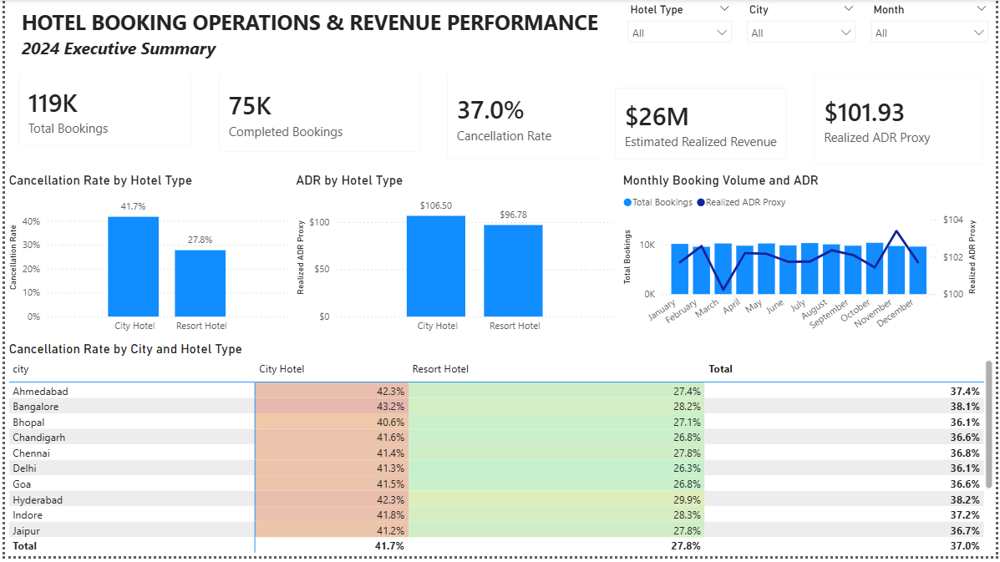
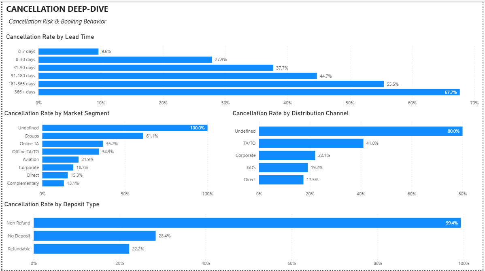
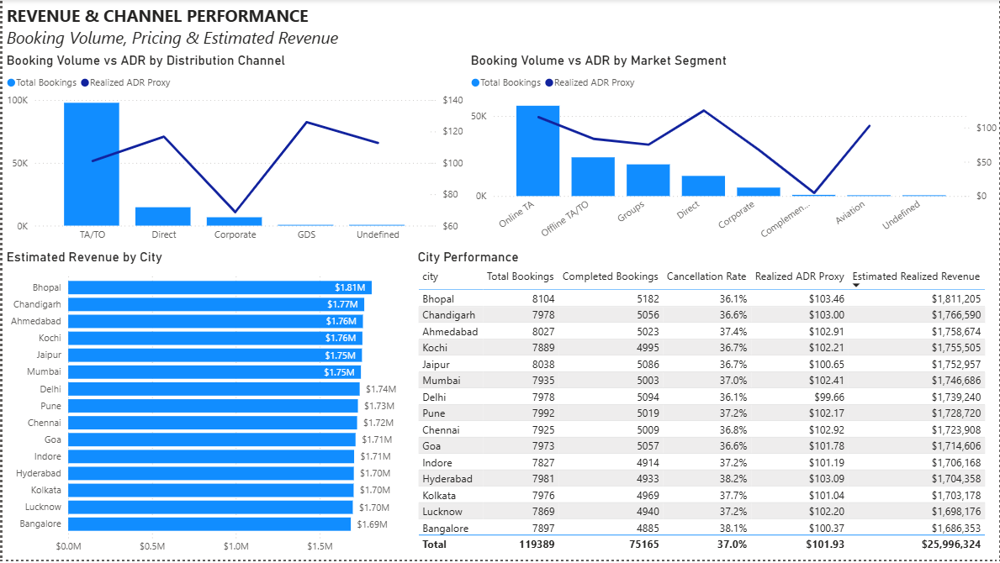
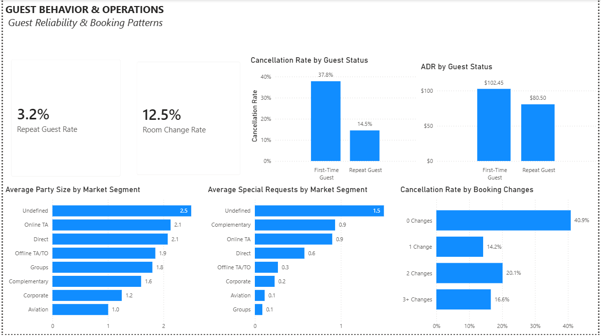

# Hotel Booking Operations & Revenue Performance Dashboard

## Project Overview

This project analyzes **119,389 hotel bookings** using Power BI to identify patterns in cancellation risk, estimated revenue, booking-channel performance, and guest behavior.

The goal was to transform booking-level hotel data into an interactive business intelligence dashboard that a hotel revenue or operations manager could use to answer questions such as:

- What booking characteristics are associated with higher cancellation rates?
- How do City Hotels and Resort Hotels differ in performance?
- Which booking channels generate the most volume and value?
- Which cities contribute the most estimated realized revenue?
- How do repeat guests differ from first-time guests?
- What operational patterns could help improve booking reliability and revenue planning?

The final solution includes:

- Power Query data preparation
- Star-schema data modeling
- Custom DAX measures
- Interactive and synchronized slicers
- Conditional formatting
- Four business-focused Power BI dashboard pages

---

# Dashboard Preview

## 1. Executive Summary

The Executive Summary provides an overall view of hotel performance, including booking volume, cancellations, estimated realized revenue, ADR, monthly trends, and city-level cancellation behavior.

### Key KPIs

- **Total Bookings:** 119,389
- **Completed Bookings:** 75,165
- **Cancellation Rate:** 37.0%
- **Estimated Realized Revenue:** ~$26.0M
- **Realized ADR Proxy:** $101.93

---

## 2. Cancellation Deep-Dive

This page analyzes cancellation behavior across:

- Lead time
- Market segment
- Distribution channel
- Deposit type

One of the strongest patterns in the dataset is the relationship between booking lead time and cancellation rate.

| Lead Time | Cancellation Rate |
|---|---:|
| 0–7 days | 9.6% |
| 8–30 days | 27.9% |
| 31–90 days | 37.7% |
| 91–180 days | 44.7% |
| 181–365 days | 55.5% |
| 366+ days | 67.7% |

Cancellation rates increase consistently as bookings are made farther in advance.

---

## 3. Revenue & Channel Performance

This page compares booking volume and ADR across distribution channels and market segments while also evaluating estimated realized revenue by city.

The dashboard allows users to compare:

- Booking volume
- Completed bookings
- Cancellation rates
- ADR
- Estimated realized revenue

The analysis also demonstrates why booking volume alone should not be used to evaluate channel performance.

---

## 4. Guest Behavior & Operations

This page examines guest reliability and operational booking behavior.

### Key Guest Metrics

- **Repeat Guest Rate:** 3.2%
- **Room Change Rate:** 12.5%

Repeat guests show considerably lower observed cancellation rates than first-time guests.

| Guest Type | Cancellation Rate | Realized ADR Proxy |
|---|---:|---:|
| First-Time Guest | 37.8% | $102.45 |
| Repeat Guest | 14.5% | $80.50 |

This suggests an important business trade-off: repeat guests appear more reliable, while first-time guests generate a higher average room rate.

---

# Business Problem

Hotel reservations do not automatically translate into completed stays or realized revenue.

Cancellations, booking channels, lead time, guest type, deposit policies, and other reservation characteristics can materially affect hotel revenue and operational planning.

This project was designed to answer five main business questions:

1. **What booking characteristics are associated with higher cancellation rates?**
2. **How do City Hotels and Resort Hotels differ in cancellation behavior and ADR?**
3. **Which booking channels and market segments generate the most volume and value?**
4. **Which cities contribute the most estimated realized revenue?**
5. **How do repeat guests differ from first-time guests in reliability and room value?**

---

# Dataset

The analysis uses a cleaned hotel-booking dataset containing approximately **119K booking records**.

The data include fields related to:

- Hotel type
- City
- Arrival dates
- Lead time
- Cancellation status
- ADR
- Length of stay
- Market segment
- Distribution channel
- Customer type
- Deposit type
- Repeat guest status
- Reserved and assigned room type
- Booking changes
- Special requests
- Previous cancellations
- Guest counts

The dashboard focuses on **2024 booking activity**.

---

# Data Cleaning & Preparation

The data was cleaned and transformed before being loaded into the final Power BI model.

Key preparation steps included:

- Parsed date fields into proper date types
- Removed the `company` field because of extremely high missingness
- Handled missing travel-agent values as no-agent/direct bookings where appropriate
- Created data-quality flags rather than automatically deleting questionable records
- Flagged extreme ADR values
- Created a zero-guest flag
- Created a room-change indicator
- Created repeat vs. first-time guest labels
- Created booking-change groups
- Created more detailed lead-time categories
- Created numeric helper columns for proper category sorting

### Lead Time Groups

The following lead-time groups were created:

- 0–7 days
- 8–30 days
- 31–90 days
- 91–180 days
- 181–365 days
- 366+ days

---

# Data Model

The dataset was modeled using a **star schema**.

The central fact table contains individual booking records and connects to six dimension tables.

### Fact Table

- `fact_bookings`

### Dimension Tables

- `dim_date`
- `dim_hotel`
- `dim_market_segment`
- `dim_distribution_channel`
- `dim_customer_type`
- `dim_deposit_type`

Relationships use a standard:

**Dimension (1) → Fact (*)**

structure with single-direction filtering.

The date dimension was also marked as Power BI's official Date Table.

<!-- Upload a Model View screenshot and uncomment the line below -->

<!--  -->

---

# DAX & Calculated Metrics

A dedicated `_Measures` table was created to organize the main business calculations.

Custom DAX measures were created for:

- Total and completed bookings
- Canceled bookings
- Cancellation rate
- Gross booking value
- Estimated realized revenue
- Canceled booking value
- Realized ADR proxy
- Average booking ADR
- Average length of stay
- Average lead time
- Repeat guest rate
- Room change rate
- Average party size
- Average special requests
## AI Assistance

ChatGPT was used as a development assistant for Power BI, including guidance on Power Query transformations, star-schema design, and DAX measures.

Final modeling decisions, validation, and business conclusions were reviewed and completed by me.
